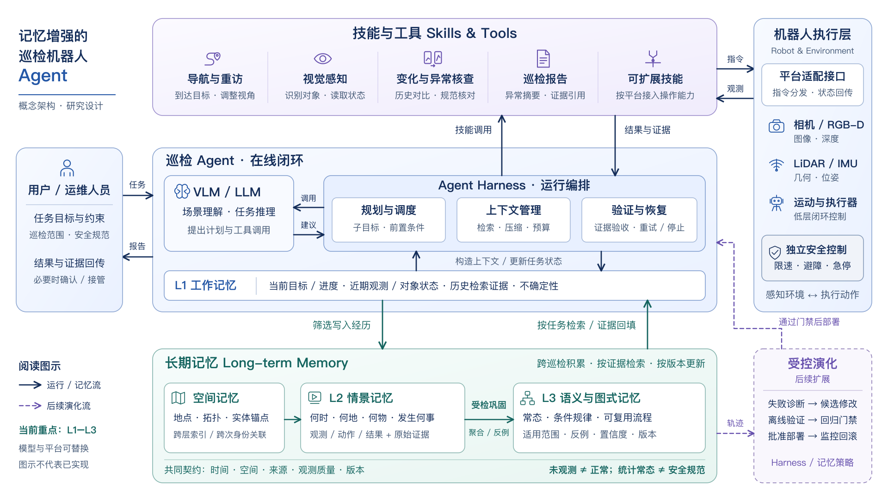

# 记忆增强的巡检机器人 Agent：系统架构与设计说明

日期：2026-09-21。状态：面向学术汇报的**架构设计提案**，不是已实现系统或实验结果。结合用户结构草图、现有 L3 巩固提案、Harness 调研及项目路线图整理；不冻结模型、机器人本体、部署位置或存储后端。

- [可编辑 SVG](figures/inspection-agent-architecture/inspection-agent-architecture.svg)
- [高清 PNG，3840 × 2160](figures/inspection-agent-architecture/inspection-agent-architecture-2x.png)
- [生成与检查记录](figures/inspection-agent-architecture/README.md)

## 1. 对原始草图的判断

草图的总体分工合理：用户提供任务，Agent 通过技能连接机器人，工作记忆维持当前状态，长期记忆承接跨巡检经验。它能够把模型推理、可执行能力与持久知识分开，适合本项目长期记忆研究的定位。

需要进一步明确的不是增加模型数量，而是以下边界。

| 原图中的关系 | 本图中的细化 | 设计理由 |
| --- | --- | --- |
| VLM 与 Harness 并列 | 模型负责理解和提出建议；Harness 负责调用模型、调度技能、管理上下文、验证和恢复 | 将“模型认为完成”与“依据环境证据确认完成”分开 |
| Agent 与技能双向交互 | 上行是技能调用，下行是结果、状态和证据 | 调用成功不等于完成巡检目标；需要检查后置条件 |
| 技能与硬件交互 | 通过平台适配接口分发指令、回传观测，保留底层控制和独立安全控制 | 高频控制和急停等约束不依赖语言模型的推理时延或判断 |
| 工作记忆置于 Agent 外 | 将 L1 放入运行时，作为有限容量的当前任务状态 | L1 是组织当前观测与检索证据的工作空间，不是又一个完整历史库 |
| 空间、情景、语义三类长期记忆 | 保留三类，但空间记忆明确为跨层索引，L2/L3 表示经历与抽象层级 | 空间、时间是组织维度；认知层级是抽象程度，两者不宜混为同一分类轴 |
| 工作记忆与长期记忆双向连接 | 区分“筛选写入经历”和“按任务检索、证据回填” | 避免把所有上下文直接永久保存，或将历史结论无条件放入当前决策 |
| 长期记忆持续增长 | 增加 L2→L3 受检巩固，另列后续受控演化 | 记忆积累、知识巩固和修改运行机制是不同过程 |

空间记忆包括长期地点、拓扑和实体锚点；当前位姿、局部对象状态和活动子目标则属于 L1。图中空间记忆指向 L2 的箭头表示空间关联与索引，不表示所有经历必须先经过一个独立的“空间学习阶段”。空间锚点也可被 L3 规律引用。

## 2. 在线巡检：模型、Harness 与技能的分工

**用户与任务约束。** 用户给出巡检目标、范围、完成条件与适用安全规范；系统返回报告及原始证据定位。高风险、证据冲突或任务超出权限时，Harness 可以请求确认、交还控制或停止。已知安全规范来自授权配置或人员输入，不由历史频率自行推导。

**VLM / LLM。** 接收当前视觉证据、目标及经过筛选的历史材料，理解场景、提出子目标、建议调用哪些工具。这里表示可替换的模型能力接口，可以由单模型或分工模型实现；图中没有预设端云双模型部署，也不要求更新基础模型参数。

**Agent Harness。** 它是持续执行的运行框架，而不仅是一段提示词，至少承担三项职责。

1. **规划与调度：** 管理可恢复的子目标、技能参数、前置条件、取消与超时；依据新证据重规划。
2. **上下文管理：** 选择当前有效观测，按对象、地点、时间和任务检索历史；压缩重复内容，保留来源、不确定性与计算预算。
3. **验证与恢复：** 对照实际观测、技能返回状态及任务完成条件进行检查。失败时区分看不清、身份不确定、执行失败和规则冲突，再选择补看、重试、降级或停止。

这些是一个协调 Agent 的职责划分，不要求三个独立模型或复杂多 Agent 系统，与现有提案“一个协调 Agent 加确定性工具即可启动”的选择一致。

**技能与工具。** 导航与重访负责到达目标、调整视角；视觉感知负责对象发现及状态判读；变化与异常核查负责调用历史对比和规范核对工具；报告工具组织可追溯结果。操作技能按机器人能力接入，不作为初版巡检的必要条件。技能以结构化结果、证据引用和失败原因返回，而非只输出一段成功描述。

**执行层。** 平台适配接口把高层技能连接到传感器、定位与底层运动控制。图中的 RGB-D、LiDAR、IMU 是能力示意，不是必须同时存在的硬件清单。避障、限速、急停等安全机制在底层独立执行；模型和 Harness 的语义验收不能替代它们。图中将执行层内部服务以能力清单表示，未展开设备总线和高频控制线路。

在线循环为：任务进入 → 构造上下文 → 模型建议 → Harness 检查并调度 → 技能执行与观测 → 基于证据验证 → 更新工作记忆 → 继续执行或返回报告。用户与技能的箭头连接到 Agent 边界，逻辑上均由 Harness 接收和发出。

## 3. L1—L3 记忆：从当前状态到有边界的规律

| 模块 | 保存什么 | 对当前任务的作用 |
| --- | --- | --- |
| L1 工作记忆 | 当前目标和进度、近期观测、短期对象关联、检索证据、未解决问题 | 保持单次巡检的一致性，避免重复执行和上下文膨胀 |
| 空间记忆 | 地点、拓扑关系、实体锚点、空间关联质量 | 确定“在哪里”“是否为同一处设施”，支撑重访与跨次比较 |
| L2 情景记忆 | 带时空信息的观测、动作、结果、可见性、失败轨迹及原始媒体引用 | 回答“过去发生了什么”，为比较与复核提供事实依据 |
| L3 语义与图式记忆 | 对象语义、条件常态、重复活动模式、经检验的过程知识 | 回答“在这些条件下通常怎样”，帮助选择检查内容与复核方式 |

**写入与检索。** L1 的全部上下文不直接复制到长期库。写入器根据事件、变化、异常、失败和必要覆盖信息生成结构化经历，保留原始证据指针。模型推测、直接观测和已验证事实应有不同状态。检索按照任务及当前时间版本返回相关经历或规律，经过来源、时效、身份和适用条件检查后进入 L1。

**受检巩固。** L2→L3 是后台或巡检间歇的慢过程：聚合跨次经历 → 形成候选解释 → 重看关键证据 → 检验替代解释与反例 → 在独立日期验证 → 提交带版本的规律。图中“受检巩固”压缩表达这一流程，不意味着一次摘要或一次反思即可生成可靠知识。置信度、统计量和身份更新应由可重放工具计算，模型主要提出解释和安排检查。

**两条关键约束。** “没有看到”可能是遮挡、模糊或未覆盖，不能直接当作正常或负例。历史高频状态只是描述性常态；安全规范具有独立来源，持续出现的违规行为仍可持续触发告警。L3 可以沉淀过程知识，但知识条目的写入并不自动安装或升级可执行技能。

空间、L2、L3 都应保留时间、空间、来源、观测质量、置信信息和版本。旧知识发生冲突时追加修订与有效期，不删除原始反例以维持表面一致。当前图刻意不把 L4 预测规划和 L5 元记忆画成已具备模块。

## 4. 一个贯穿全图的例子

以下为说明设计的假设场景，不是实际运行结果：用户要求机器人检查某段公共通道是否被占用。

1. Harness 将任务拆为到达、观察、对比、核查与报告；导航技能根据空间索引找到相应地点。
2. 视觉技能报告当前图像、对象位置及可判读程度，L1 保存当前进度和不确定性。
3. 系统用地点和实体锚点检索 L2 历史片段，以及该条件下适用的 L3 常态；比较工具区分真正变化与视角、光照或身份误配。
4. 历史对比用于发现变化，外部通行规范用于判断违规。即使历史中物品一直占道，也不能因此判为合规；若视野遮挡，则补拍或报告未知。
5. Harness 验证对象位置、当前证据及任务覆盖，返回带位置、时间和图像引用的报告，将本次经历写入 L2。
6. 多次经历可以支持新的常态候选，但只有通过反例检查与独立验证，才更新 L3。若反复出现“没看清就结束”的运行失败，才将其作为后续 Harness 改进候选的输入。

## 5. 受控演化的边界与研究价值

图右下角的虚线区域是后续研究方向：从已保存的轨迹中诊断重复失败，提出 Harness 或记忆策略修改，在离线回放、仿真或影子环境中验证，经过性能、安全、资源和回归门禁，再按权限批准部署，并保留监控与回滚。

这一环路不表示在线 Agent 可以随时改写生产控制程序。知识条目更新与运行代码更新分别管理；演化开发集、候选选择集和最终测试集也须隔离。虚线同时表明它是后续范围，实线模块同样属于设计提案，不能据此宣称已实现。

本架构想检验的核心问题是：**可追溯的跨巡检经历和受检规律，能否改善变化判断、补充观测选择与任务完成质量，同时减少旧记忆误导？** 这是一项待验证假设。后续至少应比较无长期记忆、仅 L2 检索和 L2＋受检 L3，并控制感知模型、技能能力和计算预算；分别评估异常判断、证据正确性、未知处理、任务完成率及资源成本。

## 6. 图注与汇报讲稿

**建议图注：** 记忆增强的巡检机器人 Agent 概念架构。模型与 Agent Harness 协同完成任务理解、技能调度、上下文管理及证据验证；技能通过平台适配接口连接机器人感知和执行。L1 工作记忆维护当前任务状态，空间索引与 L2 情景记忆支持跨巡检证据检索，L2 经历经反例检验等受检巩固形成具有适用范围和版本的 L3 语义与图式知识。虚线表示后续受控演化路径；图中模块与连线均为研究设计，尚不构成实现或性能结论。

**约一分钟的讲解：** 这套系统把巡检看成一个有记忆、能验证的持续任务。上层模型负责理解场景和提出计划，Harness 负责把计划变成受约束的技能执行，并检查结果是否得到真实观测支持。下面的 L1 保存当前目标和证据；空间记忆帮助找到同一地点与设施，L2 保存实际经历，L3 则从多次经历中归纳带反例、范围和版本的规律。这样，历史不仅能被查到，还能帮助机器人判断哪里发生变化、何时应该补看。但历史上的常见现象不能替代安全规范。等这个记忆闭环得到验证后，再研究如何从重复失败中受控地改进 Harness 和记忆策略。

## 7. 来源与风格说明

- 用户结构草图：本图的功能主线与原始模块来源，见[归档草图](figures/inspection-agent-architecture/reference/user-sketch.png)。
- [项目路线图](../docs/plan/roadmap.md)：L1—L3 阶段范围，以及验证、门禁、部署与回滚要求。
- [L3 记忆巩固 Agent 提案](../research/2026-09-07/l3-memory-consolidation-agent.md)，§3—9：可观测性、L2 经历、规律巩固、统计常态与规范规则、单协调 Agent 和与机器人解耦的开发方式。
- [Harness 自进化调研](../research/2026-09-17/agent-harness-evolution-survey.md)，§1、§4：记忆积累与持久机制演化的区别，以及候选评估边界。
- [Embodied AgentOS 框架调研](../research/2026-09-21/embodied-agentos-framework-survey.md)：模型、技能、记忆和执行验证的分层参考，不构成本项目平台选型。
- [ABot-AgentOS，v3 Figure 1](https://arxiv.org/html/2607.10350v3#S2.F1)：本次已读取图像及图注。借鉴中央分层、两侧边栏、浅蓝紫青配色、圆角分区与图标语言；改为 16:9 横向中文汇报布局，重新绘制矢量元素。没有沿用其端云双模型、私有/公共记忆划分或具体技能品牌。

图中新增的功能边界与连接是根据本项目目标提出的设计判断，并非对参考论文方法的复现。有关项目效果的实验检查均为 **not run**：本次仅完成架构设计与制图。
